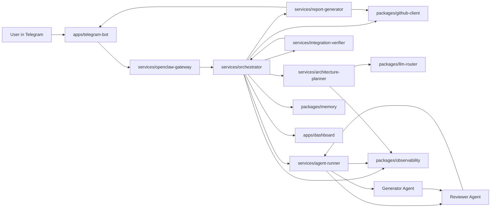
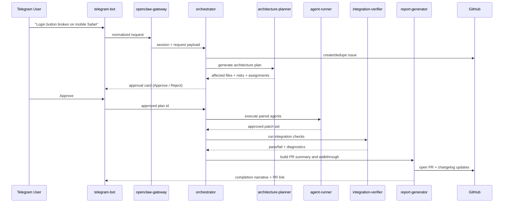

# System Architecture

This architecture is optimized for the hackathon requirement: one reliable end-to-end path from chat request to merged-quality PR.

## Layered View

1. Interface Layer
- `apps/telegram-bot`
- `services/openclaw-gateway`

2. Triage and Planning Layer
- `services/orchestrator`
- `services/architecture-planner`

3. Execution Layer
- `services/agent-runner`
- `services/integration-verifier`
- `services/report-generator`

4. Shared Platform Layer
- `packages/contracts`
- `packages/llm-router`
- `packages/memory`
- `packages/github-client`
- `packages/observability`

## Component Graph

## Core Request Lifecycle (Must Ship)

## Service Ownership and Boundaries

- `openclaw-gateway`
  - Owns message ingress, channel adapters, user/session correlation.
  - Must not contain business orchestration logic.

- `orchestrator`
  - Owns workflow state machine and approval gate enforcement.
  - Must not call model providers directly; always uses `packages/llm-router` or downstream services.

- `architecture-planner`
  - Produces deterministic plan objects and risk flags.
  - Inputs: issue context + repo metadata. Outputs typed plan contract.

- `agent-runner`
  - Manages generator/reviewer loop and retry policy.
  - No direct GitHub writes.

- `integration-verifier`
  - Executes test suites and static checks in isolated worker context.

- `report-generator`
  - Creates PR description, changelog entries, and user-facing summary.

## Runtime Rules

1. No code is written before explicit approval event is persisted.
2. All inter-service messages use `packages/contracts` schemas.
3. All model calls pass through `packages/llm-router` for provider policy + redaction.
4. All agent actions emit traces through `packages/observability`.
5. Secrets are runtime-injected and never persisted in conversation memory.

## Initial Deployment Topology

- Local hackathon: Docker Compose under `infra/docker`.
- Process split:
  - One web process for `apps/dashboard` and `apps/landing-page`.
  - One bot process for `apps/telegram-bot`.
  - One worker process per service in `services/*`.
- Shared Redis for memory and job queue.
- Postgres (or SQLite fallback for demo) for durable run records.
